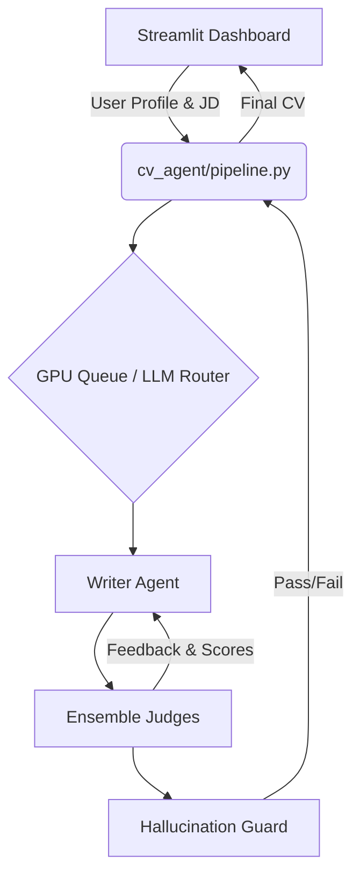

# 📄 CV Agent 


**CV Agent SaaS** is an advanced, agentic AI platform designed to automatically generate, evaluate, and optimize professional Resumes (CVs). Powered by **LangGraph**, **FastAPI**, and **Streamlit**, it utilizes a multi-agent architecture to ensure your CV is ATS-friendly, highly impactful, and tailored to your target job description.

---

## ✨ Key Features

- 🤖 **Agentic CV Generation:** Leverages state-of-the-art LLMs to draft, refine, and polish CV content iteratively.
- ⚖️ **Ensemble Judges:** Includes multiple AI judges (ATS Judge, HR Judge, Rule-based Judge) to score and provide feedback on Clarity, Structure, Impact, and Skills Relevance.
- 🛡️ **Hallucination Guard:** Built-in safeguards and ontology matching to prevent the AI from fabricating skills, experiences, or metrics.
- 🎨 **Multi-Template Export:** Generate CVs in multiple beautiful templates (Classic, Modern, Monochrome) and export them to **PDF** or **Markdown**.
- 🧠 **RAG & Semantic Matching:** Uses `sentence-transformers` and `FAISS` to match candidate skills with Job Descriptions semantically.
- 🚀 **Performance Optimized:** Features LRU Caching and a Serial GPU Queue for efficient model inference and concurrent request handling.
- 📊 **Interactive Dashboard:** A comprehensive Streamlit dashboard for generating CVs, testing the hallucination guard, analyzing scores, and monitoring system health.

---

## 🏗️ System Architecture



---

## 🛠️ Technology Stack

- **Core Frameworks:** LangGraph, LangChain, FastAPI, Streamlit
- **AI & ML:** PyTorch, HuggingFace Transformers, PEFT, Accelerate
- **RAG & Embeddings:** FAISS, Sentence-Transformers, Scikit-learn
- **Data Handling & Export:** Pydantic, ReportLab (PDF), Mistune (Markdown), PyPDF, pdfplumber

---

## 🚀 Installation & Setup

### 1. Clone the repository
```bash
git clone https://github.com/yourusername/cv-agent-saas.git
cd cv-agent-saas
```

### 2. Create a virtual environment (Recommended)
```bash
python -m venv venv
# On Windows
venv\Scripts\activate
# On macOS/Linux
source venv/bin/activate
```

### 3. Install Dependencies
```bash
# If you are using a GPU, install PyTorch with CUDA first:
pip install torch --index-url https://download.pytorch.org/whl/cu121

# Install the rest of the requirements
pip install -r requirements.txt
```

### 4. Environment Variables
Create a `.env` file in the root directory and add your necessary API keys (e.g., Groq, HuggingFace, etc.):
```env
# Example .env configuration
GROQ_API_KEY=your_groq_api_key_here
HF_TOKEN=your_huggingface_token_here
```

---

## 🎮 Usage

Start the interactive Streamlit dashboard:

```bash
streamlit run streamlit_app.py
```

### Dashboard Modules:
1. **🏠 Dashboard:** Overview of system health, active modules, and cache stats.
2. **✍️ Generate CV:** Input candidate details, select a template, and generate an AI-optimized CV.
3. **🛡️ Guard Test:** Manually test CV texts against the Hallucination Guard.
4. **📊 Scores:** Simulate and analyze the scoring thresholds of the Ensemble Judges.
5. **⚙️ System:** View pipeline configurations, manage cache, and check module health.

---

## 📁 Project Structure

```text
cv_project/
├── streamlit_app.py       # Main Streamlit frontend application
├── requirements.txt       # Project dependencies
├── .env                   # Environment variables (API Keys)
├── cv_sessions.db         # Local database for sessions/cache
├── cv_agent/              # Core Agentic backend module
│   ├── api.py             # FastAPI integration
│   ├── cache.py           # LRU Caching mechanism
│   ├── config.py          # Pipeline & System configuration
│   ├── gpu_queue.py       # Serial queue for GPU task management
│   ├── hallucination_guard.py # Hallucination detection logic
│   ├── judges.py          # AI Evaluators (HR, ATS, Rule)
│   ├── memory.py          # Agent memory management
│   ├── model_manager.py   # LLM initialization and routing
│   ├── pdf_export.py      # PDF generation using ReportLab
│   ├── pipeline.py        # Main LangGraph execution pipeline
│   ├── prompts.py         # System prompts for agents
│   ├── rag.py             # FAISS Retrieval-Augmented Generation
│   ├── routing.py         # Semantic routing logic
│   └── schemas.py         # Pydantic data models
└── tests/                 # Unit tests
```

---

## 🤝 Contributing

Contributions are welcome! Please feel free to submit a Pull Request.

1. Fork the repository
2. Create your feature branch (`git checkout -b feature/AmazingFeature`)
3. Commit your changes (`git commit -m 'Add some AmazingFeature'`)
4. Push to the branch (`git push origin feature/AmazingFeature`)
5. Open a Pull Request

---

## 📄 License

This project is licensed under the MIT License - see the LICENSE file for details.
