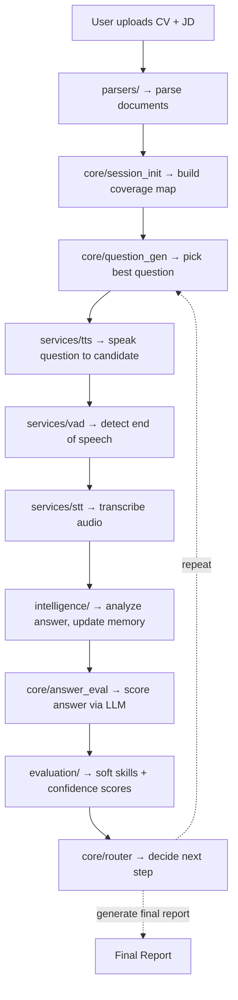

<div align="center">
  <h1>🎙️ AI Voice Interview System</h1>
  <p>An intelligent, dynamic, and state-of-the-art AI-driven voice interview orchestration system.</p>
</div>

---

## 📖 Overview

The **AI Voice Interview System** is an advanced platform that automates the technical and behavioral interview process. By analyzing a candidate's CV alongside the target Job Description (JD), the system tailors the interview questions in real-time. It features a complete pipeline from parsing documents to real-time voice interaction, leveraging the power of Large Language Models (LLMs) and local/cloud audio processing.

The system is designed in three distinct phases:
1. **Phase 1 (Data Layer):** Knowledge retrieval, vector storage (ChromaDB), and document embeddings.
2. **Phase 2 (Orchestration):** LLM integration using LangGraph & LangChain, driving the dynamic state and logic of the interview.
3. **Phase 3 (Voice I/O & API):** A FastAPI-driven backend with WebSocket streaming for real-time Speech-to-Text (STT) and Text-to-Speech (TTS), integrated with Voice Activity Detection (VAD).

---

## ✨ Features

- **📄 Smart Document Parsing:** Dynamically extracts required skills from Job Descriptions and compares them with the candidate's uploaded CV (PDF/DOCX/TXT).
- **🧠 Dynamic Orchestration:** Powered by **LangGraph**, the interview adapts its flow based on the candidate's answers, generating follow-up questions intelligently.
- **🗣️ Real-Time Voice Interaction:** Uses WebSockets for low-latency audio streaming. Supports barge-in and end-of-speech detection via VAD.
- **🎙️ Flexible Audio Engines:**
  - **STT (Speech-to-Text):** Local (Faster-Whisper) or Cloud (Deepgram).
  - **TTS (Text-to-Speech):** Free (Edge-TTS) or Premium Cloud (ElevenLabs).
- **📊 Comprehensive Evaluation:** Dedicated modules for assessing candidate confidence, technical proficiency, and soft skills.
- **💾 Interview Memory:** Maintains session state and memory across the conversation to provide a highly contextual experience.

---

## 🛠️ Technology Stack

- **Backend Framework:** [FastAPI](https://fastapi.tiangolo.com/), Uvicorn, WebSockets
- **LLM Orchestration:** [LangChain](https://python.langchain.com/), [LangGraph](https://python.langchain.com/docs/langgraph)
- **Vector Database:** [ChromaDB](https://www.trychroma.com/)
- **Audio Processing:** 
  - STT: `faster-whisper`, Deepgram (optional)
  - TTS: `edge-tts`, ElevenLabs (optional)
  - VAD: Built-in voice activity detection.
- **Document Parsing:** `PyMuPDF` (PDFs), `python-docx`
- **Data & Computation:** Pandas, PyTorch, Sentence-Transformers, NumPy

---

## 📁 Project Structure

```text
interview-system/
│
├── server.py                    # 🚀 Main FastAPI entry point — run this!
├── config.py                    # ⚙️  Centralized configuration & env loader
├── requirements.txt             # 📦 Python dependencies
├── .env.example                 # 🔑 Environment variables template (copy → .env)
│
├── core/                        # 🧠 LangGraph Orchestration Engine
│   ├── interview_state.py       #    TypedDict state shared across all nodes
│   ├── llm_config.py            #    LLM model configuration (Groq)
│   ├── graph.py                 #    Graph assembly — wires nodes & edges
│   ├── nodes.py                 #    session_init, question_gen, answer_eval, report_gen
│   └── router.py                #    Conditional routing logic between nodes
│
├── data_layer/                  # 💾 Phase 1 — Data & Knowledge Layer
│   ├── phase1_data_layer.py     #    ChromaDB vector store + Pandas CSV engine
│   └── phase2_orchestration.py #    CLI tool for running/testing the interview flow
│
├── parsers/                     # 📄 Document Parsing
│   ├── cv_parser.py             #    Extracts skills & experience from CV (PDF/DOCX)
│   └── jd_parser.py             #    Extracts requirements from Job Description text
│
├── services/                    # 🎙️ Audio I/O Services
│   ├── stt_service.py           #    Speech-to-Text (Whisper local / Deepgram cloud)
│   ├── tts_service.py           #    Text-to-Speech (Edge-TTS free / ElevenLabs cloud)
│   └── vad_service.py           #    Voice Activity Detection (end-of-speech signals)
│
├── evaluation/                  # 📊 Answer Evaluation Modules
│   ├── confidence_evaluator.py  #    AI decision: is there enough data to end interview?
│   ├── soft_skills_evaluator.py #    Rates communication, clarity, structure per answer
│   └── analyze_code.py          #    Static analysis utility for code answers
│
├── intelligence/                # 🤖 Interview Intelligence Layer
│   ├── adaptive_followup.py     #    Memory-aware follow-up question generation
│   ├── smart_question_gen.py    #    3-tier question sourcing (dataset → search → LLM)
│   ├── interview_memory.py      #    Cross-turn memory: claims, contradictions, depth
│   └── context_manager.py      #    Transcript summarization (prevents context bloat)
│
├── api/                         # 🔌 API & Session Management
│   ├── session_manager.py       #    Bridges WebSocket audio ↔ LangGraph engine
│   └── admin_dashboard.py       #    Streamlit dashboard for monitoring sessions
│
├── frontend/                    # 🖥️ Frontend
│   └── static/
│       └── index.html           #    Web UI for the interview
│
├── data/                        # 📂 Interview Knowledge Base (CSV datasets)
│   ├── questions_master.csv     #    5000+ interview questions
│   ├── domain_rubrics.csv       #    Scoring rubrics per domain
│   ├── answer_calibration.csv   #    Score calibration data
│   ├── question_chains.csv      #    Follow-up question chains
│   ├── role_expectations.csv    #    Role-specific requirements
│   └── skill_hierarchy.csv      #    Skill taxonomy & hierarchy
│
└── tests/                       # 🧪 Test Suite
    ├── test_api.py               #    End-to-end API flow tests
    ├── test_bugs.py              #    Regression & edge case tests
    ├── test_full_flow.py         #    Full interview simulation tests
    └── check_q.py               #    Quick question dataset checks
```

---

## ⚙️ Configuration & Environment Variables

Copy `.env.example` to `.env` and fill in your actual API keys:

```bash
cp .env.example .env
```

```env
# --- LLM Provider (Required) ---
GROQ_API_KEY="your_groq_api_key_here"

# --- Audio Service Selection ---
STT_PROVIDER="whisper"    # "whisper" (local, free) or "deepgram" (cloud)
WHISPER_MODEL="base"      # tiny | base | small | medium | large-v3
TTS_PROVIDER="edge"       # "edge" (local, free) or "elevenlabs" (cloud)

# --- Server Settings ---
SERVER_HOST="127.0.0.1"
SERVER_PORT=8000
```

> **⚠️ Never commit your `.env` file!** It is listed in `.gitignore`.

---

## 🚀 Installation & Setup

### 1. Prerequisites
- Python 3.9+
- `ffmpeg` installed on your system (Required for Audio processing).
  - Windows: `winget install ffmpeg`
  - Linux: `sudo apt install ffmpeg`
  - macOS: `brew install ffmpeg`

### 2. Clone the Repository

```bash
git clone <repository-url>
cd interview-system
```

### 3. Create & Activate Virtual Environment

```bash
python -m venv interview-env

# Windows:
interview-env\Scripts\activate

# macOS/Linux:
source interview-env/bin/activate
```

### 4. Install Dependencies

```bash
pip install -r requirements.txt
```

### 5. Configure Environment

```bash
cp .env.example .env
# Edit .env with your API keys
```

### 6. Run the Server

```bash
python server.py
# OR
uvicorn server:app --host 127.0.0.1 --port 8000 --reload
```

The API will be available at: `http://127.0.0.1:8000`

---

## 🔌 API Endpoints

### **REST API**
| Method | Endpoint | Description |
|--------|----------|-------------|
| `GET` | `/` | Serves the frontend web UI |
| `POST` | `/api/sessions` | Create session (JD text + CV file upload) |
| `GET` | `/api/sessions/{id}` | Get current session state |
| `POST` | `/api/sessions/{id}/text-answer` | Submit a text-based answer |

### **WebSocket API**
- `WS /ws/{session_id}` — Real-time bidirectional audio stream.
  - **Client sends:** Binary audio chunks or JSON text answers.
  - **Server sends:** Audio responses (`audio_b64`), transcriptions, phase changes, evaluation results.

---

## 🧠 Core Workflow



---

## 🤝 Contributing
Contributions are welcome! Please create a Pull Request with detailed information about your changes. Ensure that you test your features thoroughly, especially WebSocket edge cases.

## 📜 License
This project is proprietary and confidential unless otherwise specified by the author.
