# NHA-4-151
<div align="center">

# 🚀 Career Pilot

### AI-Powered Career Management Platform

[](https://python.org)
[](https://python.langchain.com/docs/langgraph)
[](https://fastapi.tiangolo.com)
[](https://streamlit.io)
[](https://huggingface.co)
[](LICENSE)

**Career Pilot** is a modular, AI-driven platform that covers the entire career lifecycle — from **analyzing your resume**, to **building an optimized CV**, to **matching you with relevant jobs**, and **conducting AI-powered voice interviews**.

[Resume Analysis](#-1-resume-analysis) · [CV Builder](#-2-cv-builder-agent) · [Job Matching](#-3-job-matching-agent) · [Interview System](#-4-ai-voice-interview-system)

</div>

---

## 📑 Table of Contents

- [Platform Overview](#-platform-overview)
- [High-Level Architecture](#-high-level-architecture)
- [Sub-Projects](#-sub-projects)
  - [1. Resume Analysis](#-1-resume-analysis)
  - [2. CV Builder Agent](#-2-cv-builder-agent)
  - [3. Job Matching Agent](#-3-job-matching-agent)
  - [4. AI Voice Interview System](#-4-ai-voice-interview-system)
- [Technology Stack](#-technology-stack)
- [Quick Start](#-quick-start)
- [Project Structure](#-project-structure)
- [Contributing](#-contributing)
- [License](#-license)

---

## 🌐 Platform Overview

Career Pilot is composed of **4 independent but complementary sub-projects**, each tackling a critical stage in the job-seeking process:

| # | Sub-Project | Description | Core Tech |
|---|-------------|-------------|-----------|
| 1 | **Resume Analysis** | AI-powered resume scoring using a fine-tuned Qwen2 model with LoRA | Transformers, PEFT, FastAPI |
| 2 | **CV Builder Agent** | Agentic CV generation with ensemble judges & hallucination guards | LangGraph, FAISS, ReportLab |
| 3 | **Job Matching Agent** | Deep job research, skill matching & cover letter generation | LangGraph, Tavily, FPDF |
| 4 | **Voice Interview** | Real-time AI voice interview with adaptive follow-ups | LangGraph, WebSocket, Whisper |

---

## 🏗 High-Level Architecture

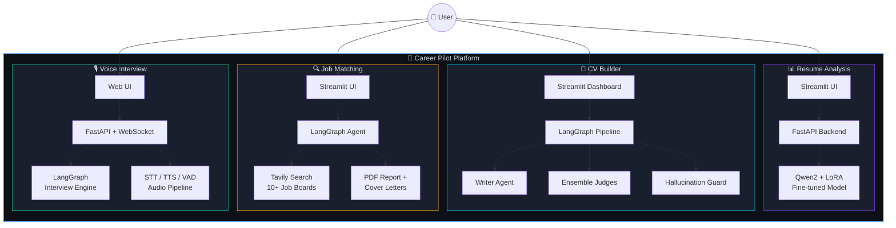

---

## 📦 Sub-Projects

---

### 📊 1. Resume Analysis

> AI-powered resume evaluation using a **fine-tuned Qwen2** model with **LoRA adapter** for structured CV scoring.

#### Features

- 🤖 **Fine-Tuned Model** — Custom Qwen2 model (`OsamaHayba/qwen-ats-merged-stage1`) with LoRA adapter (`OsamaHayba/cv-analysis-final-stage2`)
- 📊 **10-Field Structured Output** — Clarity, Structure, Impact, Skills Relevance, ATS Readiness scores + strengths, weaknesses, and suggestions
- ⚡ **4-bit Quantization** — Runs efficiently on consumer GPUs (≥6 GB VRAM) via bitsandbytes NF4
- 📄 **PDF Parsing** — Direct PDF upload and text extraction via PyMuPDF
- 🌐 **Dual Mode** — Run as Streamlit-only (direct inference) or FastAPI + Streamlit

#### Architecture

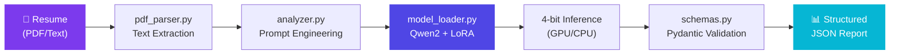

#### Data Flow

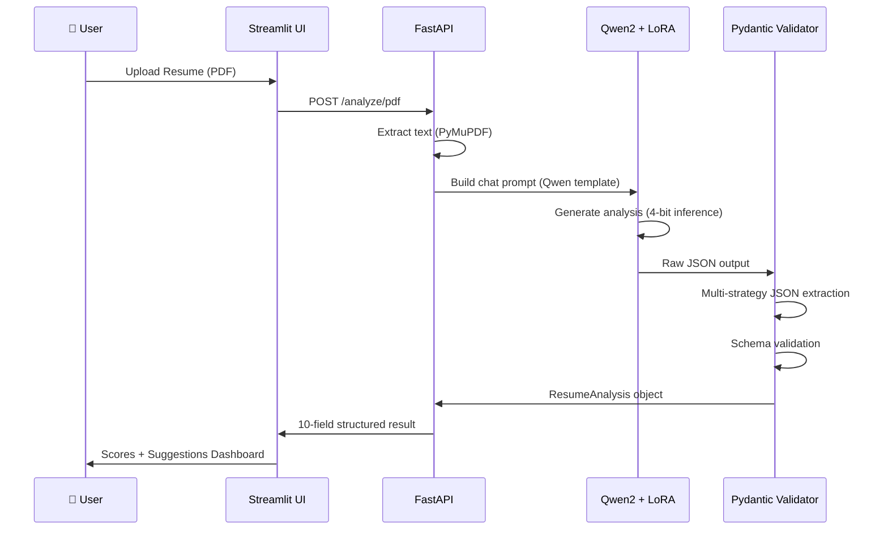

#### Output Schema

| Field | Type | Description |
|-------|------|-------------|
| `clarity_score` | int (0-100) | How clear and readable |
| `structure_score` | int (0-100) | How well-organized |
| `impact_score` | int (0-100) | How effectively achievements are communicated |
| `skills_relevance_score` | int (0-100) | How relevant skills are to target role |
| `ats_readiness_score` | int (0-100) | ATS optimization level |
| `overall_score` | float (0-100) | Weighted overall score |
| `strengths` | list[str] | Resume strengths |
| `weaknesses` | list[str] | Resume weaknesses |
| `improvement_suggestions` | list[str] | Actionable improvements |
| `rewrite_suggestions` | list[str] | Specific rewrite recommendations |

#### API Endpoints

| Method | Path | Description |
|--------|------|-------------|
| `POST` | `/analyze` | Analyze resume text |
| `POST` | `/analyze/pdf` | Upload & analyze PDF |
| `GET` | `/health` | Health check + model status |

<details>
<summary>📁 Directory Structure</summary>

```text
resume-analysis/
├── app.py                  # FastAPI backend
├── streamlit_app.py        # Streamlit frontend
├── requirements.txt
├── .env.example
├── core/
│   ├── __init__.py
│   ├── model_loader.py     # Model + LoRA adapter loading (4-bit)
│   ├── analyzer.py         # Prompt engineering + JSON parsing
│   ├── schemas.py          # Pydantic output schemas
│   └── pdf_parser.py       # PDF text extraction (PyMuPDF)
└── README.md
```

</details>

---

### 📄 2. CV Builder Agent

> An **agentic, multi-iteration** CV generation platform with ensemble judges, hallucination guards, and semantic matching — powered by **LangGraph**.

#### Features

- 🤖 **Agentic CV Generation** — Multi-iteration write → judge → revise loop using LangGraph's StateGraph
- ⚖️ **Ensemble Judges** — ATS Judge, HR Judge, and Rule-based Judge score Clarity, Structure, Impact, and Skills Relevance
- 🛡️ **Hallucination Guard** — Ontology matching + semantic verification to prevent fabricated skills or metrics
- 🎨 **Multi-Template PDF Export** — Classic, Modern, Monochrome templates via ReportLab
- 🧠 **RAG & Semantic Matching** — FAISS + Sentence-Transformers for JD-to-skill semantic matching
- 🚀 **GPU Queue & Caching** — Serial GPU queue for concurrency + LRU cache for fast re-evaluations
- 📊 **Best-CV Tracking** — Automatically selects the highest-scoring CV across all iterations

#### LangGraph Pipeline

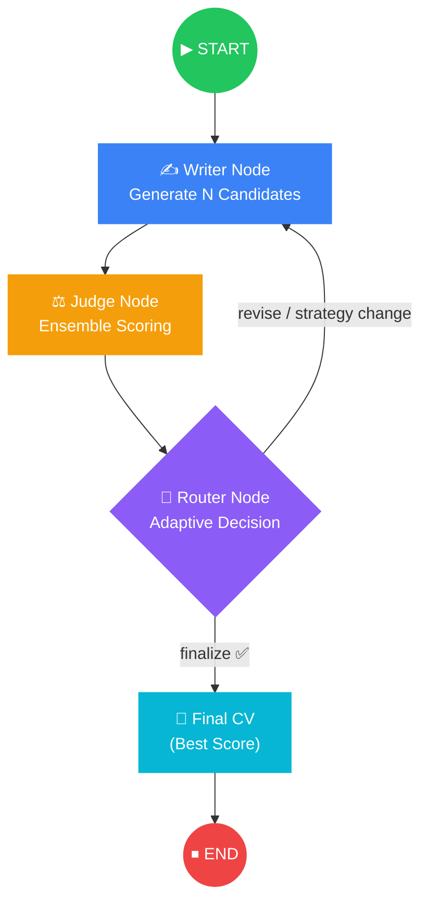

#### Detailed Pipeline Flow

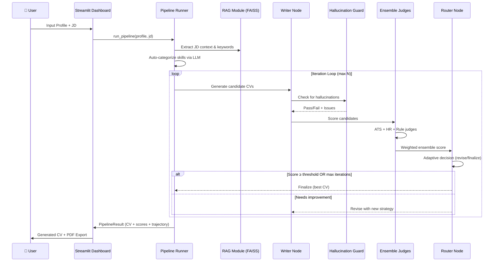

#### Writer → Judge → Router Components

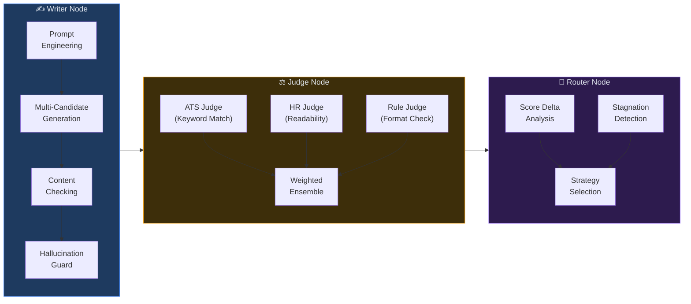

<details>
<summary>📁 Directory Structure</summary>

```text
cv-builder/
├── streamlit_app.py           # Main Streamlit frontend
├── requirements.txt
├── .env
├── cv_sessions.db             # Session cache database
├── cv_agent/                  # Core agentic backend
│   ├── __init__.py
│   ├── api.py                 # FastAPI integration
│   ├── cache.py               # LRU caching mechanism
│   ├── config.py              # Pipeline & system configuration
│   ├── content_checker.py     # Content quality verification
│   ├── gpu_queue.py           # Serial GPU queue management
│   ├── hallucination_guard.py # Hallucination detection logic
│   ├── judges.py              # AI evaluators (HR, ATS, Rule)
│   ├── memory.py              # Agent memory management
│   ├── model_manager.py       # LLM initialization and routing
│   ├── pdf_export.py          # PDF generation (ReportLab)
│   ├── pipeline.py            # LangGraph execution pipeline
│   ├── prompts.py             # System prompts for agents
│   ├── rag.py                 # FAISS retrieval-augmented generation
│   ├── routing.py             # Semantic routing & strategy logic
│   ├── schemas.py             # Pydantic data models
│   └── utils.py               # Utility functions
└── tests/                     # Unit & integration tests
    ├── test_api.py
    ├── test_cache.py
    ├── test_content_checker.py
    ├── test_hallucination_guard.py
    ├── test_hallucination_guard_edge.py
    ├── test_integration.py
    ├── test_routing.py
    └── test_schemas.py
```

</details>

---

### 🔍 3. Job Matching Agent

> An intelligent **LangGraph agent** that automates deep job research, skill matching, cover letter generation, and PDF report export — searching across **10+ global and MENA job boards**.

#### Features

- 🔎 **Multi-Board Search** — LinkedIn, Indeed, Glassdoor, Wuzzuf, Bayt, Forasna, NaukriGulf, WeWorkRemotely, RemoteOK, Wellfound
- 🧠 **Smart Resume Extraction** — LLM-powered skill, experience, and role extraction with quality-check retry loop
- 🌐 **Dynamic Site Discovery** — AI discovers niche job boards relevant to your profile
- ⚡ **Async Parallel Search** — Concurrent Tavily API searches across all platforms
- 🎯 **AI Skill Matching** — LLM-scored job matching (0-100) with gap analysis
- 🔬 **Deep Company Research** — Glassdoor reviews, culture insights for top matches
- ✉️ **Auto Cover Letters** — Tailored 3-paragraph cover letters for top 3 positions
- 📄 **PDF Report** — Full career research report with FPDF

#### LangGraph Agent Pipeline

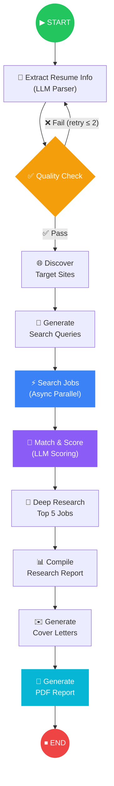

#### Detailed Workflow

```mermaid
sequenceDiagram
    participant U as 👤 User
    participant UI as Streamlit UI
    participant A as LangGraph Agent
    participant LLM as Groq LLM
    participant T as Tavily Search API
    participant PDF as FPDF Generator

    U->>UI: Upload Resume + Set Filters
    UI->>A: invoke(resume_text, location, date_filter)

    rect rgb(30, 40, 60)
        Note over A,LLM: Phase 1 — Resume Extraction
        A->>LLM: Extract skills, titles, level
        LLM->>A: Structured JSON
        A->>A: Quality check (retry if incomplete)
    end

    rect rgb(30, 50, 40)
        Note over A,T: Phase 2 — Job Discovery
        A->>LLM: Discover niche job boards
        A->>LLM: Generate 8-10 search queries
        A->>T: Async parallel search (all boards)
        T->>A: Raw job listings (deduplicated)
    end

    rect rgb(50, 30, 50)
        Note over A,LLM: Phase 3 — Matching & Research
        A->>LLM: Score each job (0-100 match)
        A->>T: Deep research top 5 companies
        A->>LLM: Compile career research report
    end

    rect rgb(40, 40, 30)
        Note over A,PDF: Phase 4 — Deliverables
        A->>LLM: Generate 3 cover letters
        A->>PDF: Build PDF report
        PDF->>A: career_report.pdf
    end

    A->>UI: Final state (report + jobs + letters)
    UI->>U: Interactive results dashboard
```

#### Agent State

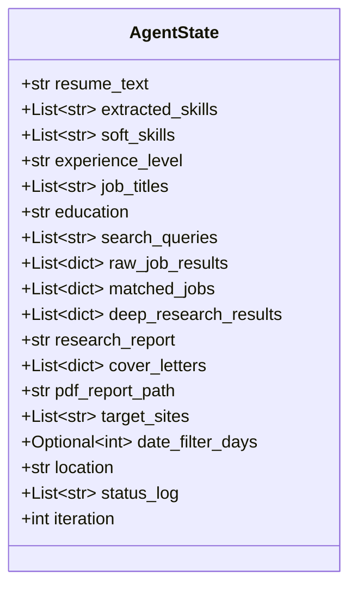

<details>
<summary>📁 Directory Structure</summary>

```text
jop-matching/
├── main.py               # Entry point
├── requirements.txt
├── .env.example
├── core/
│   ├── agent.py           # LangGraph graph builder + runner
│   ├── nodes.py           # All 9 pipeline nodes
│   ├── state.py           # AgentState TypedDict
│   └── utils.py           # LLM & Tavily helpers
└── ui/
    └── app.py             # Streamlit web interface (34KB)
```

</details>

---

### 🎙️ 4. AI Voice Interview System

> An intelligent, real-time **AI voice interview** platform with adaptive questioning, multi-phase evaluation, and comprehensive candidate assessment — powered by **LangGraph**, **WebSockets**, and local/cloud audio processing.

#### Features

- 📄 **Smart Document Parsing** — Extracts skills from JD and matches against uploaded CV (PDF/DOCX/TXT)
- 🧠 **Dynamic Orchestration** — LangGraph-driven interview flow that adapts based on candidate answers
- 🗣️ **Real-Time Voice I/O** — WebSocket streaming with barge-in detection and VAD
- 🎙️ **Flexible Audio Engines** — STT (Faster-Whisper / Deepgram) + TTS (Edge-TTS / ElevenLabs)
- 📊 **Multi-Dimensional Evaluation** — Technical proficiency, soft skills, confidence assessment
- 🧠 **Interview Memory** — Cross-turn memory tracking claims, contradictions, and depth
- 🔗 **3-Tier Question Sourcing** — Dataset (5000+ questions) → Web Search → LLM Generation
- 📋 **5-Phase Interview** — Opening → Technical → Behavioral → Situational → Closing

#### LangGraph Interview Engine

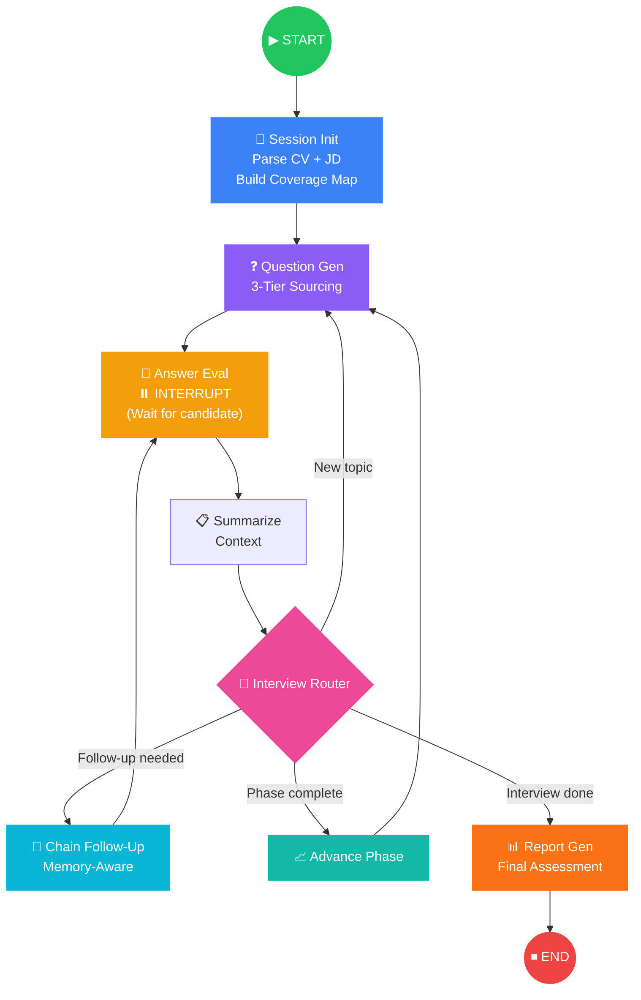

#### 3-Phase System Architecture

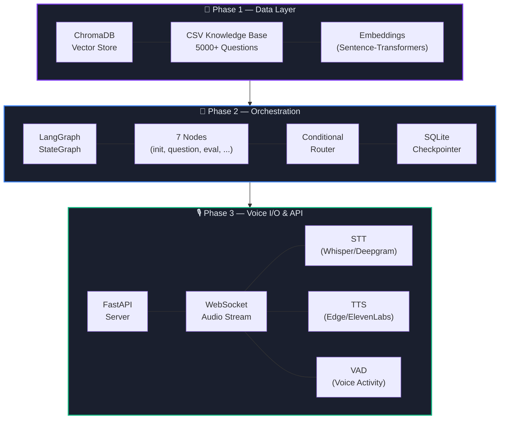

#### Real-Time Voice Interaction Flow

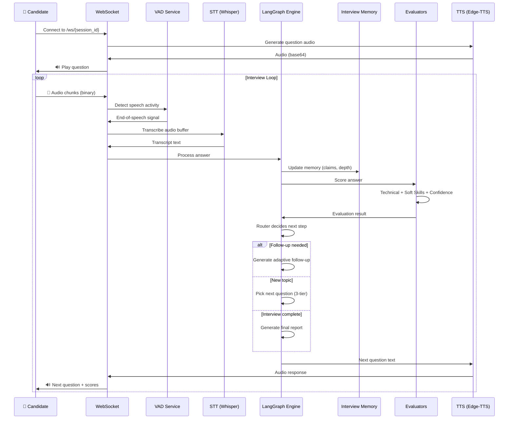

#### Intelligence Layer

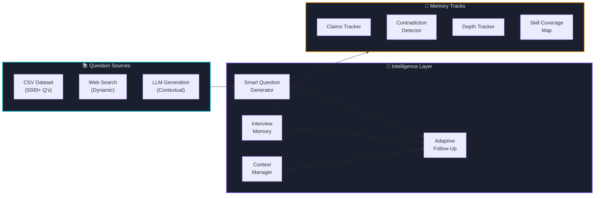

#### API Endpoints

**REST API**

| Method | Endpoint | Description |
|--------|----------|-------------|
| `GET` | `/` | Serves the frontend web UI |
| `POST` | `/api/sessions` | Create session (JD text + CV file upload) |
| `GET` | `/api/sessions/{id}` | Get current session state |
| `POST` | `/api/sessions/{id}/text-answer` | Submit a text-based answer |

**WebSocket API**

| Endpoint | Direction | Format |
|----------|-----------|--------|
| `WS /ws/{session_id}` | Client → Server | Binary audio chunks or JSON text answers |
| `WS /ws/{session_id}` | Server → Client | Audio responses, transcriptions, scores, phase changes |

#### Knowledge Base (CSV Datasets)

| Dataset | Description |
|---------|-------------|
| `questions_master.csv` | 5000+ interview questions across domains |
| `domain_rubrics.csv` | Scoring rubrics per domain |
| `answer_calibration.csv` | Score calibration data |
| `question_chains.csv` | Follow-up question chains |
| `role_expectations.csv` | Role-specific requirements |
| `skill_hierarchy.csv` | Skill taxonomy & hierarchy |

<details>
<summary>📁 Directory Structure</summary>

```text
interview-system/
├── server.py                    # FastAPI entry point
├── config.py                    # Centralized configuration
├── requirements.txt
├── .env.example
│
├── core/                        # LangGraph Orchestration Engine
│   ├── interview_state.py       # TypedDict shared state
│   ├── llm_config.py            # LLM model configuration (Groq)
│   ├── graph.py                 # Graph assembly (7 nodes)
│   ├── nodes.py                 # session_init, question_gen, answer_eval, report_gen
│   └── router.py                # Conditional routing logic
│
├── data_layer/                  # Phase 1 — Data & Knowledge Layer
│   ├── phase1_data_layer.py     # ChromaDB vector store + Pandas engine
│   └── phase2_orchestration.py  # CLI testing tool
│
├── parsers/                     # Document Parsing
│   ├── cv_parser.py             # CV extraction (PDF/DOCX)
│   └── jd_parser.py             # JD requirements extraction
│
├── services/                    # Audio I/O Services
│   ├── stt_service.py           # Speech-to-Text (Whisper/Deepgram)
│   ├── tts_service.py           # Text-to-Speech (Edge/ElevenLabs)
│   └── vad_service.py           # Voice Activity Detection
│
├── evaluation/                  # Answer Evaluation
│   ├── confidence_evaluator.py  # Interview confidence scoring
│   ├── soft_skills_evaluator.py # Communication & clarity rating
│   └── analyze_code.py          # Code answer analysis
│
├── intelligence/                # Interview Intelligence
│   ├── adaptive_followup.py     # Memory-aware follow-up generation
│   ├── smart_question_gen.py    # 3-tier question sourcing
│   ├── interview_memory.py      # Cross-turn memory management
│   └── context_manager.py       # Transcript summarization
│
├── api/                         # API & Session Management
│   ├── session_manager.py       # WebSocket ↔ LangGraph bridge
│   └── admin_dashboard.py       # Streamlit monitoring dashboard
│
├── frontend/static/             # Web UI
│   └── index.html
│
├── data/                        # Knowledge Base (CSV)
│   ├── questions_master.csv     # 5000+ questions
│   ├── domain_rubrics.csv
│   ├── answer_calibration.csv
│   ├── question_chains.csv
│   ├── role_expectations.csv
│   └── skill_hierarchy.csv
│
└── tests/                       # Test Suite
    ├── test_api.py
    ├── test_bugs.py
    ├── test_full_flow.py
    └── check_q.py
```

</details>

---

## 🛠 Technology Stack

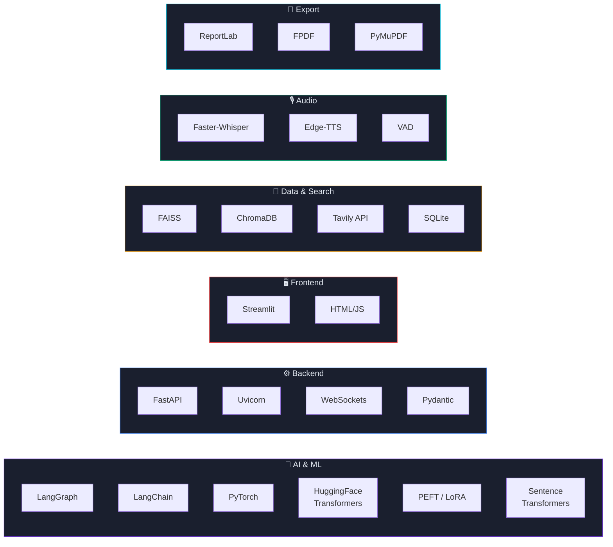

| Category | Technologies |
|----------|-------------|
| **LLM Orchestration** | LangGraph, LangChain, Groq API |
| **AI / ML Models** | PyTorch, HuggingFace Transformers, PEFT, Accelerate, bitsandbytes |
| **Embeddings & RAG** | FAISS, Sentence-Transformers, ChromaDB |
| **Backend** | FastAPI, Uvicorn, WebSockets, Pydantic |
| **Frontend** | Streamlit, HTML/JS |
| **Audio** | Faster-Whisper (STT), Edge-TTS (TTS), VAD, Deepgram, ElevenLabs |
| **Search** | Tavily API |
| **PDF & Parsing** | ReportLab, FPDF, PyMuPDF, python-docx |
| **Data** | Pandas, SQLite, Redis |
| **Testing** | pytest |

---

## ⚡ Quick Start

### Prerequisites

- **Python** 3.10+
- **GPU** (recommended): NVIDIA GPU with ≥6 GB VRAM + CUDA
- **ffmpeg** (for Interview System audio processing)

### 1. Clone the Repository

```bash
git clone https://github.com/yourusername/career-pilot.git
cd career-pilot
```

### 2. Choose a Sub-Project

Each sub-project is self-contained with its own `requirements.txt` and `.env`:

```bash
# Resume Analysis
cd resume-analysis
pip install -r requirements.txt
streamlit run streamlit_app.py

# CV Builder
cd cv-builder
pip install -r requirements.txt
streamlit run streamlit_app.py

# Job Matching
cd jop-matching
pip install -r requirements.txt
python main.py

# Interview System
cd interview-system
pip install -r requirements.txt
python server.py
```

### 3. Configure Environment

Each sub-project requires API keys in a `.env` file:

```env
# Common
GROQ_API_KEY=your_groq_api_key
HF_TOKEN=your_huggingface_token

# Job Matching
TAVILY_API_KEY=your_tavily_api_key

# Interview System (Optional)
STT_PROVIDER=whisper          # whisper | deepgram
TTS_PROVIDER=edge             # edge | elevenlabs
```

> ⚠️ **Never commit your `.env` files!** Use `.env.example` as a template.

---

## 📁 Project Structure

```text
career-pilot/
│
├── 📊 resume-analysis/        # Fine-tuned Qwen2 resume scorer
│   ├── app.py                 # FastAPI backend
│   ├── streamlit_app.py       # Streamlit frontend
│   └── core/                  # Model loader, analyzer, schemas, parser
│
├── 📄 cv-builder/             # Agentic CV generation platform
│   ├── streamlit_app.py       # Dashboard UI
│   └── cv_agent/              # 15+ modules (pipeline, judges, guard, RAG...)
│
├── 🔍 jop-matching/           # Deep job research agent
│   ├── main.py                # Entry point
│   ├── core/                  # LangGraph agent (9 nodes)
│   └── ui/                    # Streamlit interface
│
├── 🎙️ interview-system/       # AI voice interview platform
│   ├── server.py              # FastAPI + WebSocket server
│   ├── core/                  # LangGraph engine (7 nodes)
│   ├── services/              # STT, TTS, VAD audio services
│   ├── intelligence/          # Adaptive follow-up, memory, question gen
│   ├── evaluation/            # Confidence, soft skills, code analysis
│   ├── data_layer/            # ChromaDB + knowledge base
│   ├── parsers/               # CV & JD document parsing
│   └── data/                  # 5000+ questions, rubrics, calibration
│
└── 📖 README.md               # This file
```

---

## 🤝 Contributing

Contributions are welcome! Here's how to get started:

1. **Fork** the repository
2. **Create** a feature branch: `git checkout -b feature/amazing-feature`
3. **Commit** your changes: `git commit -m 'Add amazing feature'`
4. **Push** to the branch: `git push origin feature/amazing-feature`
5. **Open** a Pull Request

### Guidelines

- Each sub-project is independent — changes should be scoped accordingly
- Add tests for new features (see `tests/` in each sub-project)
- Follow existing code style and naming conventions
- Update the relevant sub-project README if adding new modules

---

## 📄 License

This project is licensed under the **MIT License** — see the [LICENSE](LICENSE) file for details.

---

<div align="center">

**Built with ❤️ using LangGraph, PyTorch & FastAPI**

[⬆ Back to Top](#-career-pilot)

</div>

